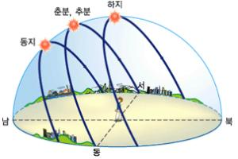
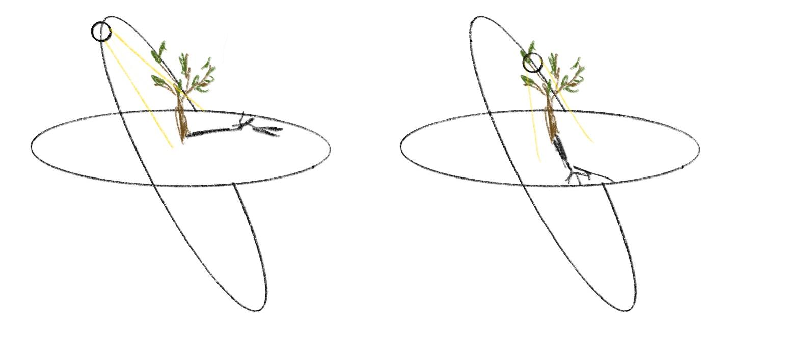
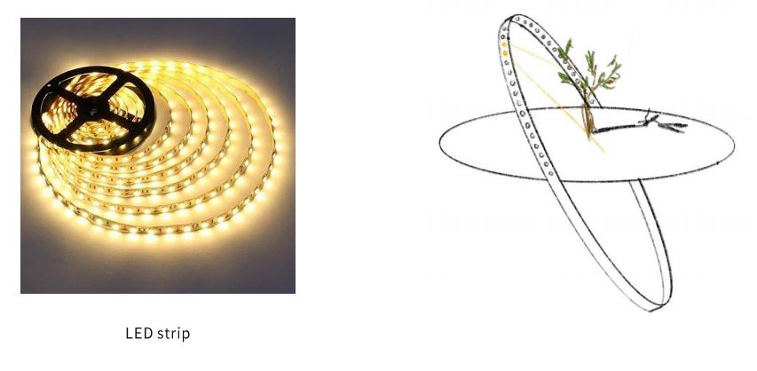
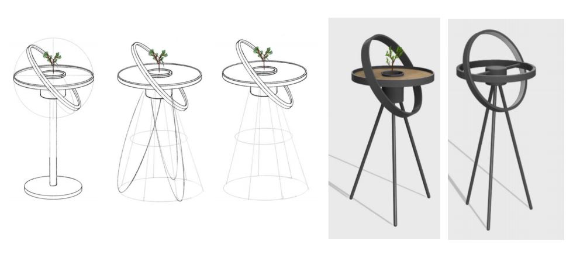
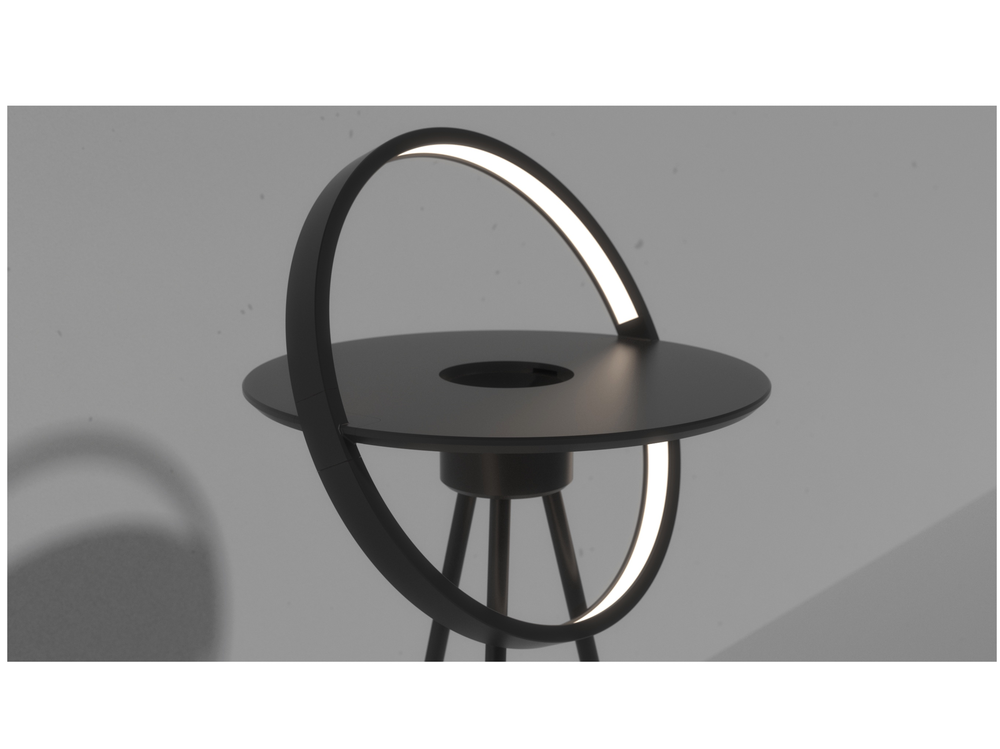

# EQUINOX

### 올리브 나무를 위한 IoT 화분 조명

gif

## Concept

- 일조량이 풍부한 지중해가 원산지인 올리브 나무
- 따라서 많은 일조량이 필요
- 조명을 설치함으로써 화분에 더 많은 빛을 제공
- 태양의 궤도의 형태에서 모티브를 얻어 제작



[**equinox](https://en.dict.naver.com/#/entry/enko/45044f37ccd5498382165af8d546b706)  [명사] 주야 평분시(춘분 또는 추분)**





- 물리적으로 조명을 움직이는 것에는 한계가 있어 아두이노와 함께 각 LED를 제어할 수 있는 네오픽셀을 이용해 태양의 궤도 표현

## Sketch & Modeling





## Function

- 로터리 앤코더 사용, 물리적으로 돌릴 수 있는 다이얼
    - 색온도 조절 기능 (2200K~11000K)
    - 밝기 조절 기능 (25단계)
- 웹앱 형태로 구현된 어플을 통해 조명 제어
- 조명 제어 기능
    - 색온도 조절 기능 (2200K~11000K)
    - 밝기 조절 기능 (255단계)
    - 조명 온오프 기능
- 당일 일출, 일몰 데이터를 이용한 태양의 현재 위치 표시 기능
    - 현재 시간 표시
    - 일출 시간 표시
    - 일몰 시간 표시

## Reference

- [https://codepen.io/rakujira/pen/WZOeNq](https://codepen.io/rakujira/pen/WZOeNq) (캘빈값을 이용한 color slider)
- [https://www.data.go.kr/data/15012688/openapi.do](https://www.data.go.kr/data/15012688/openapi.do) (한국천문연구원_출몰시각 정보)
- [https://jizard.tistory.com/330](https://jizard.tistory.com/330) (javascript canvas를 이용해 태양 그리기)
- [https://m.blog.naver.com/emperonics/222108739792](https://m.blog.naver.com/emperonics/222108739792) (로터리 엔코더 제어 코드)
- [https://www.youtube.com/watch?v=ROeT-gyYZfw&t=962s](https://www.youtube.com/watch?v=ROeT-gyYZfw&t=962s) (websocket 통신으로 실시간 데이터 전송)
- [https://www.youtube.com/watch?v=izGU0buH670&t=346s](https://www.youtube.com/watch?v=izGU0buH670&t=346s) (spiffs를 이용한 웹서버 파일(html,css,js) 업로드)

```
Copyright (c) 2022 by Ye-kki
Permission is hereby granted, free of charge, to any person obtaining a copy of this software and associated documentation files (the "Software"), to deal in the Software without restriction, including without limitation the rights to use, copy, modify, merge, publish, distribute, sublicense, and/or sell copies of the Software, and to permit persons to whom the Software is furnished to do so, subject to the following conditions:

The above copyright notice and this permission notice shall be included in all copies or substantial portions of the Software.

THE SOFTWARE IS PROVIDED "AS IS", WITHOUT WARRANTY OF ANY KIND, EXPRESS OR IMPLIED, INCLUDING BUT NOT LIMITED TO THE WARRANTIES OF MERCHANTABILITY, FITNESS FOR A PARTICULAR PURPOSE AND NONINFRINGEMENT. IN NO EVENT SHALL THE AUTHORS OR COPYRIGHT HOLDERS BE LIABLE FOR ANY CLAIM, DAMAGES OR OTHER LIABILITY, WHETHER IN AN ACTION OF CONTRACT, TORT OR OTHERWISE, ARISING FROM, OUT OF OR IN CONNECTION WITH THE SOFTWARE OR THE USE OR OTHER DEALINGS IN THE SOFTWARE.
```
